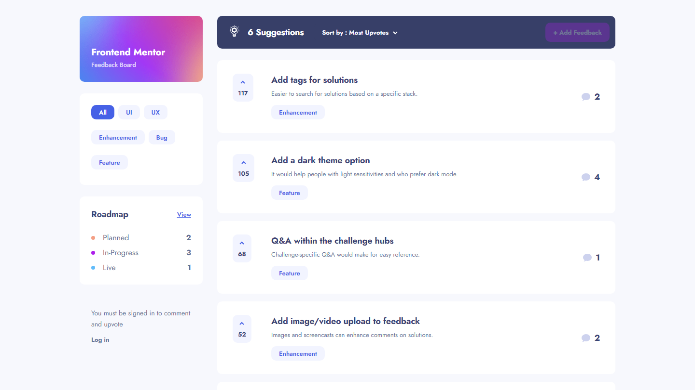

# Frontend Mentor - Product feedback app solution

This is a solution to the [Product feedback app challenge on Frontend Mentor](https://www.frontendmentor.io/challenges/product-feedback-app-wbvUYqjR6). Frontend Mentor challenges help you improve your coding skills by building realistic projects.


## Table of contents

- [Overview](#overview)
  - [The challenge](#the-challenge)
  - [Screenshot](#screenshot)
  - [Links](#links)
- [My process](#my-process)
  - [Built with](#built-with)
  - [What I learned](#what-i-learned)
  - [Continued development](#continued-development)
- [Author](#author)

## Overview

### The challenge

Users should be able to:

- View the optimal layout for the app depending on their device's screen size
- See hover states for all interactive elements on the page
- Create, read, update, and delete product feedback requests
- Receive form validations when trying to create/edit feedback requests
- Sort suggestions by most/least upvotes and most/least comments
- Filter suggestions by category
- Add comments and replies to a product feedback request
- Upvote product feedback requests
- **Bonus**: Keep track of any changes, even after refreshing the browser (`localStorage` could be used for this if you're not building out a full-stack app)

### Screenshot



### Links

- Solution URL: [GitHub Repo](https://github.com/ryanbradley-webdev/product-feedback-app)
- Live Site URL: [Hosted on Firebase](https://product-feedback-app-ce1e6.web.app/)

## My process

### Built with

- [React](https://reactjs.org/) - JS library
- [React-Router](https://reactrouter.com/en/main) - React framework
- [React-Query](https://tanstack.com/query/latest) - React framework
- [Firebase](https://firebase.google.com/) - Backend as a Service

### What I learned

This project was really a test of everything I've learned so far. User authentication, database architecture, and consistent UI structure were all vital to ensure this project functions as expected.

The biggest learning experience I had was in incorporated user authentication. Although it wasn't required as part of the challenge, I decided to implement it in order to make the application more realistic and practical. This required me to implement various checks to ensure non-authenticated users could still view the content in the app but not interact with it. I accomplished this by wrapping the application in a React Context to store and manage authentication and user data and structuring the database to handle user-specific interactions.

For example, when a user upvotes a specific feedback, the app state is optimistically updated while database logic is executed. In order to ensure a user can't upvote a given feedback more than once, user data is stored with a 'likedFeedback' property to track the IDs of all feedbacks the user has liked. When the request is sent to update the feedback's upvote count, an additional request is issued to add the feedback ID to the user's information:

**/src/lib/toggleUpvote.ts:7**
```
const feedbackRef = doc(collection(db, 'feedback'), id)

const usersRef = collection(db, 'users')

const q = query(usersRef, where('handle', '==', userHandle))

const querySnapshot = await getDocs(q)

if (querySnapshot.docs.length > 0) {
    querySnapshot.forEach(doc => {
        const docData = doc.data()

        if (docData.handle === userHandle) {
            updateDoc(doc.ref, {
                likedFeedback
            })
        }
    })
}

return await updateDoc(feedbackRef, {
    upvotes
})
```

Beyond this type of backend logic, integrating user authentication in a way that worked with the design proved to be more difficult than I expected. Specifically with the tablet design, I needed to find a way to provide an indication on the homepage for the user to understand that an account is required to interact with the application. In desktop and mobile views, I simply added a message at the bottom of the 'header' component column, however in tablet view the design was much less forgiving. I decided to move the account message to the top of the page above the header to make use of the negative space and prevent having to alter the design more than I needed to.

Overall, this project gave me a lot to work on with my frontend design skills.

### Continued development

In order to get this application up and running at what I consider 100%, I plan on adding more sections to the application associated with the user's profile and presence in the community. As of yet I have not added a method for adding a profile picture or a way to handle changing basic information or resetting credentials, however after adding these features the application will be most of the way to a fully-functioning platform for community feedback.

## Author


- Visit my portfolio - [ryanbradleyportfolio.com](https://ryanbradleyportfolio.com)
- Contact me for your next website - [ryanbradleywebdev.com](https://ryanbradleywebdev.com)
- Email me - [ryan@ryanbradleywebdev.com](ryan@ryanbradleywebdev.com)
- Follow my Instagram - [@ryanbradley_web_dev](https://www.instagram.com/ryanbradley_web_dev/)
